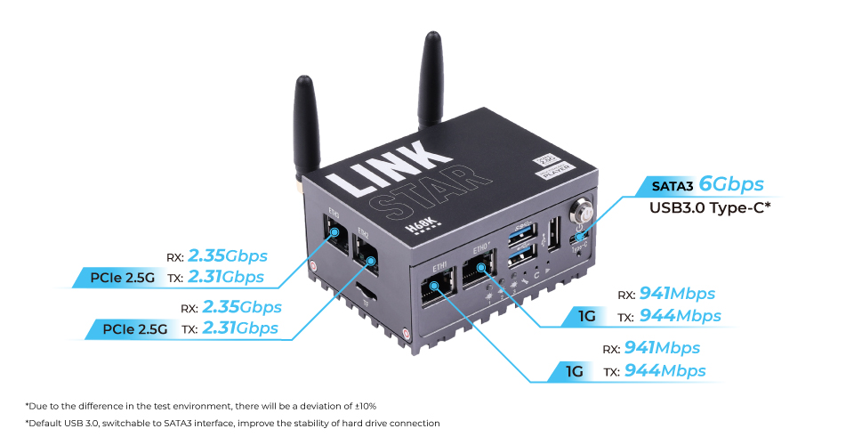
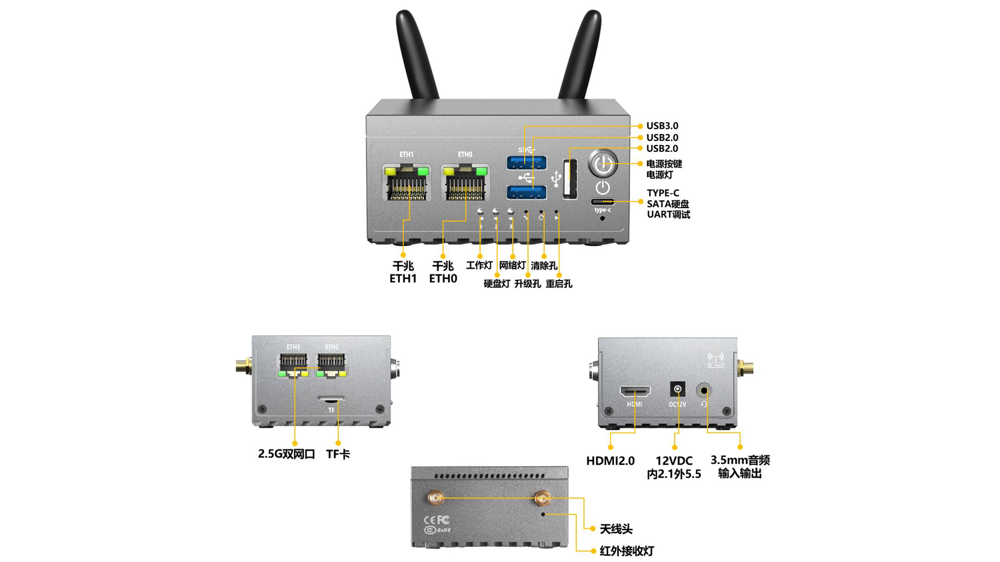

# Hinlink-H68K
Hinlink-H68K

# Description
Hinlink-H68K equips quad-core Cortex-A55 RK3568 chip, featuring dual-1G Ethernet and dual-2.5G Ethernet as 4 network interfaces overall, assembled in one portable metal box, designed for high-speed network. It comes with sufficient expansion ability and media player functionality, presenting you with a fully functional device for office work and home entertainment, as well as anywhere you travel around.

- High Storage Capacity
This compact equipment equips onboard 32GB eMMC, along with one SD card slot and one USB3.0 Type-C which supports an external hard drive for storage extension. Combined with fast-speed Ethernet, you can use it to establish a NAS(Network Attached Storage) to store and access abundant information over a network without physical file transformation.

- 4K Multimedia Player
With such storage and network capability, it houses an HDMI 2.0 port and a 3.5mm microphone port, installing Android 11 OS in advance, outputting 4K immersive visual, all of which make it a neat network media player to stream media and display instantly, while providing access to online services like Spotify or YouTube.

- Great Extensibility
Additionally, it provides an SD card slot, one USB 3.0, and two USB 2.0 ports for further usage. You can connect a USB printer with it for print serving in the office which can be available to the entire network. Meanwhile, you can switch to a different Operating System by inserting different SD cards without overwriting the original one.

- Multiple OS Support
Not only Linux systems like Ubuntu 20.04, but you can also run it with a dedicated routing system like OpenWRT for building a fast speed and secure router in concentration. You can utilize it to establish a VPN router of your own, realize remote control, block advertising, and other personal customization by your definition.

The design of Hinlink-H68K is light and mini-sized that it can be lifted by one singular hand. It is built around metal for passive heat dissipation. You can charge it with a 5-24V power adaptor and 5V Type-C connector. It is your HTPC for home entertainment, or an office PC connected to video conferencing on your business trip.

# Hardware Overview

